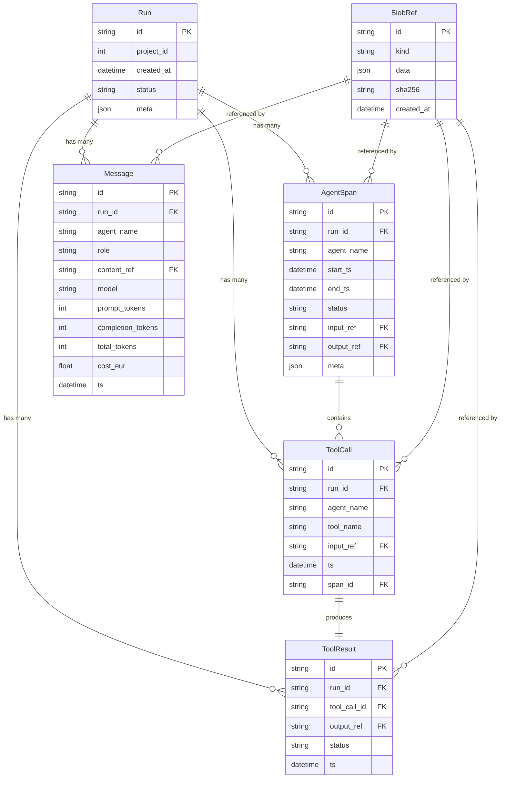

# Agentic Storage System

This document describes the comprehensive agentic movement tracking system implemented in the Orchestrator project. The system persists agent spans, messages, tool calls, and tool results to provide detailed timeline and cost analysis.

## Architecture Overview

The agentic storage system consists of:

1. **SQLModel Database Models** - Type-safe data models with proper relationships
2. **Service Layer** - Clean API for persisting agentic movements  
3. **REST API Endpoints** - Timeline and cost aggregation APIs
4. **Orchestrator Hooks** - Automatic tracking during agent execution
5. **Migration System** - Alembic-based database migrations

## Database Schema (ERD)



## Key Features

### 1. Content Storage Strategy
- **Large payloads** (messages, tool inputs/outputs) are stored in `BlobRef` table
- **References only** stored in main tables to keep them lightweight
- **SHA256 deduplication** prevents storing identical content multiple times
- **Flexible format** supports JSON and text content types

### 2. Comprehensive Tracking
- **Agent Spans** track start/end times of agent execution with status
- **Messages** capture all LLM interactions with token counts and costs
- **Tool Calls/Results** track individual tool executions with timing
- **Hierarchical structure** with spans containing tool calls

### 3. Timeline Aggregation
Events are merged and sorted chronologically:
- `agent.span.start` - Agent begins execution
- `message` - LLM message (user/assistant/system)
- `tool.call` - Tool invocation
- `tool.result` - Tool execution result
- `agent.span.end` - Agent completes execution

### 4. Cost Analysis
- **Token tracking** for all LLM interactions
- **Cost calculation** in EUR for budgeting
- **Agent-level breakdown** to identify expensive components
- **Aggregated totals** across entire runs

## API Endpoints

### GET /runs/{run_id}/timeline

Returns a unified timeline of events for a run.

**Parameters:**
- `limit` (int): Maximum events to return (1-1000, default 1000)
- `cursor` (str): Pagination cursor (future use)

**Response:**
```json
{
  "events": [
    {
      "type": "agent.span.start",
      "ts": "2024-01-01T00:00:00",
      "run_id": "123e4567-e89b-12d3-a456-426614174000",
      "agent": "planner",
      "label": "▶ planner",
      "ref": {"span_id": "span_123"},
      "meta": {"input_size": 1024}
    },
    {
      "type": "message",
      "ts": "2024-01-01T00:00:01",
      "run_id": "123e4567-e89b-12d3-a456-426614174000",
      "agent": "planner",
      "label": "assistant message",
      "ref": {"message_id": "msg_456"},
      "meta": {
        "model": "gpt-4",
        "tokens": 150,
        "cost_eur": 0.0045
      }
    },
    {
      "type": "tool.call",
      "ts": "2024-01-01T00:00:02",
      "run_id": "123e4567-e89b-12d3-a456-426614174000",
      "agent": "planner",
      "label": "call list_items",
      "ref": {"tool_call_id": "call_789"},
      "meta": {}
    },
    {
      "type": "tool.result",
      "ts": "2024-01-01T00:00:03",
      "run_id": "123e4567-e89b-12d3-a456-426614174000",
      "agent": "planner",
      "label": "list_items result",
      "ref": {"tool_result_id": "result_012"},
      "meta": {"status": "ok"}
    },
    {
      "type": "agent.span.end",
      "ts": "2024-01-01T00:00:10",
      "run_id": "123e4567-e89b-12d3-a456-426614174000",
      "agent": "planner", 
      "label": "■ planner (8.23s)",
      "ref": {"span_id": "span_123"},
      "meta": {"status": "ok", "duration": 8.23}
    }
  ]
}
```

### GET /runs/{run_id}/cost

Returns aggregated token and cost information for a run.

**Response:**
```json
{
  "by_agent": [
    {
      "agent": "planner",
      "tokens": 1250,
      "cost_eur": 0.0375
    },
    {
      "agent": "executor", 
      "tokens": 800,
      "cost_eur": 0.024
    },
    {
      "agent": "writer",
      "tokens": 2100,
      "cost_eur": 0.063
    }
  ],
  "total": {
    "agent": null,
    "tokens": 4150,
    "cost_eur": 0.1245
  }
}
```

## Service Layer API

The service layer provides clean, typed functions for persisting agentic data:

### Core Functions

```python
from orchestrator.storage.services import *

# Blob storage
blob_id = save_blob("json", {"input": "data"})

# Span tracking  
span_id = start_span(run_id, "agent_name", input_ref=blob_id)
end_span(span_id, status="ok", output_ref=output_blob_id)

# Message tracking
message_id = save_message(
    run_id, 
    role="assistant",
    content="Response text",
    agent_name="writer",
    model="gpt-4",
    tokens={"total": 150, "prompt": 100, "completion": 50},
    cost_eur=0.0045
)

# Tool tracking
call_id = save_tool_call(run_id, "agent_name", "tool_name", span_id=span_id)
result_id = save_tool_result(call_id, "ok", output_ref=result_blob_id)

# Data retrieval
timeline = get_run_timeline(run_id, limit=100)
cost_data = get_run_cost(run_id)
```

### Session Management

All functions accept optional `session` parameter for transaction control:

```python
from orchestrator.storage.db import get_session

with get_session() as session:
    span_id = start_span(run_id, "agent", session=session)
    message_id = save_message(run_id, "user", "Hello", session=session)
    # All operations in same transaction
    session.commit()
```

## Integration Points

### 1. Orchestrator Hooks

The system automatically tracks agent execution in `core_loop.py`:

- **Overall execution** wrapped in top-level span
- **Tool calls** wrapped in individual spans
- **LLM messages** tracked with token/cost data  
- **Tool results** linked to their calls

### 2. Backward Compatibility

The API endpoints gracefully fall back to the legacy system when runs don't exist in the new storage:

```python
# Check new system first
run = session.exec(select(Run).where(Run.id == run_id)).first()
if not run:
    # Fall back to old system
    old_run = crud.get_run(run_id)
    if old_run:
        return crud.get_run_timeline(run_id)
    raise HTTPException(404, "Run not found")
```

## Database Migrations

Migrations are managed through Alembic:

```bash
# Apply migrations
alembic upgrade head

# Create new migration  
alembic revision --autogenerate -m "description"
```

Current migration: `0001_agentic_storage.py`

## JSONL Log Import

For migrating existing logs, use the JSONL loader:

```bash
# Dry run to preview
python -m orchestrator.jsonl_loader logs/app-20250903.jsonl --dry-run

# Import logs
python -m orchestrator.jsonl_loader logs/app-20250903.jsonl
```

The loader provides best-effort extraction of:
- Run IDs from log messages
- Project IDs and timestamps
- Significant log events as messages

## Performance Considerations

### Indexes
- `AgentSpan(run_id, start_ts)` - Timeline queries
- `Message(run_id, ts)` - Message chronology  
- `ToolCall(run_id, ts)` - Tool call timing

### Content Strategy
- Large payloads stored in `BlobRef` to keep main tables fast
- SHA256 deduplication reduces storage overhead
- Optional pagination cursors for large timelines

### Query Optimization
- Timeline queries use single scan with in-memory sorting
- Cost aggregation uses SQL GROUP BY for efficiency
- Session management allows batched operations

## Testing

Comprehensive test coverage includes:

1. **Model Tests** - SQLModel validation and relationships
2. **Service Tests** - All CRUD operations and edge cases  
3. **API Tests** - Endpoint responses and error handling
4. **Integration Tests** - End-to-end agent tracking scenarios

Run tests:
```bash
poetry run pytest tests/test_timeline_cost.py -v
poetry run pytest tests/test_storage_services.py -v
```

## Future Enhancements

### Planned Features
- **Nested spans** for complex agent hierarchies
- **Real-time streaming** of timeline events via WebSocket
- **Cost budgets** and alerting
- **Performance metrics** (tokens/second, etc.)
- **Agent comparison** across runs

### Monitoring
- Track storage growth and cleanup old runs
- Monitor query performance and add indexes as needed
- Alert on cost anomalies or failed agent executions

---

This agentic storage system provides comprehensive observability into agent behavior, enabling debugging, optimization, and cost management for AI-powered workflows.